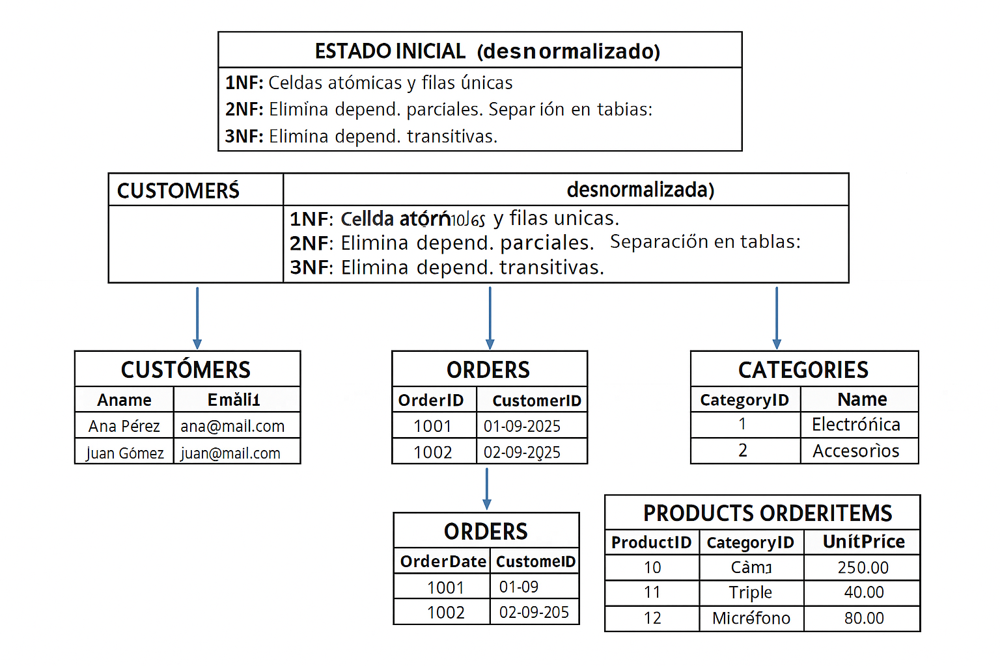
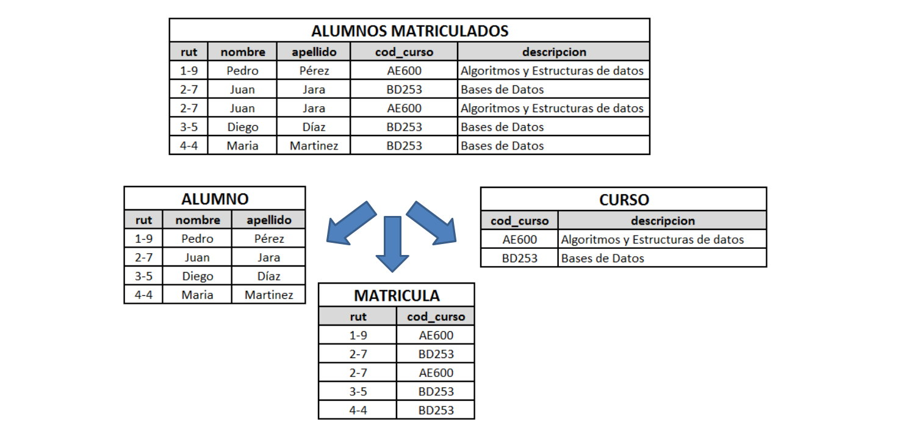

# Ejemplo práctico: normalización desde una tabla “cruda” hasta **3ª Forma Normal (3NF)** — con SQL y explicación paso a paso


## Tabla inicial (desnormalizada, `OrdersRaw`)

Esta tabla contiene pedidos donde **se repite información de cliente, producto y categoría** en cada fila; además tiene valores no atómicos posibles (p. ej. productos en una misma celda si se hubiera hecho así).

Ejemplo de creación y datos (solo para ilustrar el estado *crudo*):

```sql
CREATE TABLE OrdersRaw (
  OrderID INT,
  OrderDate DATE,
  CustomerName VARCHAR(100),
  CustomerEmail VARCHAR(100),
  CustomerPhone VARCHAR(20),
  ShippingAddress VARCHAR(200),
  ProductID INT,
  ProductName VARCHAR(100),
  CategoryName VARCHAR(50),
  UnitPrice DECIMAL(10,2),
  Quantity INT
);

INSERT INTO OrdersRaw VALUES
(1001, '2025-09-01', 'Ana Pérez', 'ana@mail.com', '341-1111', 'San Martín 123', 10, 'Cámara',   'Electrónica', 250.00, 1),
(1001, '2025-09-01', 'Ana Pérez', 'ana@mail.com', '341-1111', 'San Martín 123', 11, 'Tripié',   'Accesorios',  40.00,  1),
(1002, '2025-09-02', 'Juan Gómez','juan@mail.com','341-2222', 'Rivadavia 50', 12, 'Micrófono','Electrónica', 80.00,  2),
(1003, '2025-09-05', 'Ana Pérez', 'ana@mail.com', '341-1111', 'San Martín 123', 10, 'Cámara',   'Electrónica', 250.00, 1),
(1004, '2025-09-07', 'Lucía Díaz','lucia@mail.com','341-3333', 'Belgrano 77', 13, 'Bolsa',     'Accesorios',  25.00,  3),
(1004, '2025-09-07', 'Lucía Díaz','lucia@mail.com','341-3333', 'Belgrano 77', 11, 'Tripié',   'Accesorios',  40.00,  1);
```

### Problemas visibles en `OrdersRaw`

* **Redundancia de datos**: datos del cliente repetidos en cada fila del pedido (Ana se repite).
* **Anomalías de actualización**: si cambia el teléfono de Ana hay que actualizar varias filas.
* **Anomalías de inserción**: no puedo registrar un cliente nuevo que todavía no hizo pedidos (si la política fuera obligar a OrderID).
* **Anomalías de borrado**: si borro la última línea de un pedido podría perder la información del cliente.
* **Dependencias funcionales confusas**: `CategoryName` depende del `ProductID` (transitiva respecto a Order row).

---

## Paso 1 → **Primera Forma Normal (1NF)**

**Regla**: cada celda debe contener un **valor atómico**; la tabla debe tener filas únicas.

En nuestro caso, la tabla ya tiene filas atomizadas (cada fila un producto por pedido). Sin embargo **si** existiera una columna `ProductsList` con varios productos en una celda habría que separarla en filas. Además, en la práctica para 1NF buscamos eliminar *repetición de grupos* y asegurar una clave primaria única por fila.

Definimos clave primaria candidata: `(OrderID, ProductID)` — un pedido puede tener varios productos.

```sql
-- Marcar la tabla en 1NF: agregar PK compuesta
ALTER TABLE OrdersRaw
ADD CONSTRAINT pk_ordersraw PRIMARY KEY (OrderID, ProductID);
```

**Observación**: estar en 1NF no quita redundancia: los datos del cliente siguen repetidos. Siguiente paso: 2NF.

---

## Paso 2 → **Segunda Forma Normal (2NF)**

**Regla**: estar en 1NF **y** eliminar **dependencias parciales** respecto de una clave primaria compuesta.
Si una tabla tiene PK compuesta `(OrderID, ProductID)` y alguna columna depende **solo de OrderID** (como `CustomerName`) o **solo de ProductID** (como `ProductName`), eso es una dependencia parcial → hay que mover esas columnas a tablas separadas.

**Identificamos dependencias funcionales en `OrdersRaw`:**

* `(OrderID, ProductID) → Quantity, UnitPrice`  (depende de fila-pedido-producto)
* `OrderID → OrderDate, CustomerName, CustomerEmail, CustomerPhone, ShippingAddress` (depende solo de OrderID)
* `ProductID → ProductName, CategoryName, UnitPrice` (depende solo de ProductID)

  * nota: `UnitPrice` puede ser considerado atributo del producto (si precio es por producto) o específico del pedido (si hay descuentos por pedido). Para el ejemplo lo dejamos como atributo del producto.

**Descomposición para 2NF:**

* `Orders` (Order-level info)
* `OrderItems` (detalle por producto del pedido)
* `Customers` (información de cliente) — opcional separar si hay identificación cliente
* `Products` (info de producto)

### DDL para 2NF

```sql
-- Clientes (asumimos que CustomerEmail es único y lo usamos como identificador simple)
CREATE TABLE Customers (
  CustomerID INT IDENTITY(1,1) PRIMARY KEY,
  CustomerName VARCHAR(100),
  CustomerEmail VARCHAR(100) UNIQUE,
  CustomerPhone VARCHAR(20),
  ShippingAddress VARCHAR(200)
);

-- Productos
CREATE TABLE Products (
  ProductID INT PRIMARY KEY,
  ProductName VARCHAR(100),
  CategoryName VARCHAR(50),
  UnitPrice DECIMAL(10,2)
);

-- Pedidos (Orders) - info de pedido
CREATE TABLE Orders (
  OrderID INT PRIMARY KEY,
  OrderDate DATE,
  CustomerID INT,
  FOREIGN KEY (CustomerID) REFERENCES Customers(CustomerID)
);

-- Items del pedido (detalle) - PK compuesta
CREATE TABLE OrderItems (
  OrderID INT,
  ProductID INT,
  Quantity INT,
  UnitPrice DECIMAL(10,2), -- copiar desde Products: precio en el momento del pedido
  PRIMARY KEY (OrderID, ProductID),
  FOREIGN KEY (OrderID) REFERENCES Orders(OrderID),
  FOREIGN KEY (ProductID) REFERENCES Products(ProductID)
);
```

### Poblado (migración de datos desde OrdersRaw)

En una migración real habría que deduplicar clientes y productos; aquí un ejemplo de inserts (deduplicando por email y productid):

```sql
-- Insertar productos (deduplicados)
INSERT INTO Products (ProductID, ProductName, CategoryName, UnitPrice)
SELECT DISTINCT ProductID, ProductName, CategoryName, UnitPrice
FROM OrdersRaw;

-- Insertar clientes (deduplicando por email)
INSERT INTO Customers (CustomerName, CustomerEmail, CustomerPhone, ShippingAddress)
SELECT DISTINCT CustomerName, CustomerEmail, CustomerPhone, ShippingAddress
FROM OrdersRaw;

-- Insertar orders (tomando CustomerID por email)
INSERT INTO Orders (OrderID, OrderDate, CustomerID)
SELECT DISTINCT r.OrderID, r.OrderDate, c.CustomerID
FROM OrdersRaw r
JOIN Customers c ON r.CustomerEmail = c.CustomerEmail;

-- Insertar OrderItems
INSERT INTO OrderItems (OrderID, ProductID, Quantity, UnitPrice)
SELECT OrderID, ProductID, Quantity, UnitPrice
FROM OrdersRaw;
```

**Resultado:** eliminamos dependencias parciales. Ahora:

* `Orders` tiene solo datos dependientes de `OrderID`.
* `Products` tiene info dependiente de `ProductID`.
* `OrderItems` relaciona ambos con cantidad y precio puntual.

**Problema restante**: `Products` aún contiene `CategoryName`. ¿Depende `CategoryName` de `ProductID`? Sí — pero si `CategoryName` es a su vez atributo de una entidad categoría (con más atributos), podría existir una **dependencia transitiva**: `ProductID → CategoryID → CategoryName`. Para 3NF conviene extraer `Category`.

---

## Paso 3 → **Tercera Forma Normal (3NF)**

**Regla**: estar en 2NF **y** eliminar **dependencias transitivas**.
Si en `Products` la columna `CategoryName` no depende directamente de la clave primaria `ProductID` sino a través de una `CategoryID`, moveremos categoría a su propia tabla.

### Identificar dependencia transitiva

* `ProductID → CategoryID` y `CategoryID → CategoryName`.
  Si dejamos `CategoryName` en `Products`, entonces `Products` tiene una columna que **no depende directamente de la PK** sino por la relación a `CategoryID`.

### Descomposición a 3NF

Creamos tabla `Categories` y en `Products` reemplazamos `CategoryName` por `CategoryID`.

```sql
-- Tabla de categorías
CREATE TABLE Categories (
  CategoryID INT IDENTITY(1,1) PRIMARY KEY,
  CategoryName VARCHAR(50) UNIQUE
);

-- Modificar Products: eliminamos CategoryName y ponemos CategoryID
CREATE TABLE Products_New (
  ProductID INT PRIMARY KEY,
  ProductName VARCHAR(100),
  CategoryID INT,
  UnitPrice DECIMAL(10,2),
  FOREIGN KEY (CategoryID) REFERENCES Categories(CategoryID)
);

-- Poblado de Categories a partir de Products
INSERT INTO Categories (CategoryName)
SELECT DISTINCT CategoryName FROM Products;

-- Poblado Products_New usando CategoryID
INSERT INTO Products_New (ProductID, ProductName, CategoryID, UnitPrice)
SELECT p.ProductID, p.ProductName, c.CategoryID, p.UnitPrice
FROM Products p
JOIN Categories c ON p.CategoryName = c.CategoryName;

-- Reemplazar tabla Products por Products_New (en práctica migración controlada)
DROP TABLE Products;
EXEC sp_rename 'Products_New', 'Products';
```

> Nota: el `sp_rename` es específico de SQL Server; en otros RDBMS se usa `ALTER TABLE`/`RENAME` o recreación completa.

### ¿Qué logramos con 3NF?

* Cada tabla tiene columnas que **dependen únicamente de su clave primaria**:

  * `Categories`: `CategoryName` depende de `CategoryID`.
  * `Products`: `ProductName`, `UnitPrice`, `CategoryID` dependen de `ProductID`.
  * `Orders`: datos del pedido dependen de `OrderID`.
  * `Customers`: datos del cliente dependen de `CustomerID`.
  * `OrderItems`: cantidad y precio dependen de `(OrderID, ProductID)`.

* **Eliminamos redundancia y dependencias transitivas**, lo que reduce anomalías y mejora mantenibilidad.

---

## Consultas de verificación / ejemplos de uso

Un par de queries típicas que ahora se resuelven mediante joins:

1. **Listado de pedidos con cliente y detalle de productos:**

```sql
SELECT o.OrderID, o.OrderDate,
       c.CustomerName, c.CustomerEmail,
       oi.ProductID, p.ProductName, cat.CategoryName, oi.Quantity, oi.UnitPrice
FROM Orders o
JOIN Customers c ON o.CustomerID = c.CustomerID
JOIN OrderItems oi ON o.OrderID = oi.OrderID
JOIN Products p ON oi.ProductID = p.ProductID
JOIN Categories cat ON p.CategoryID = cat.CategoryID
ORDER BY o.OrderID;
```

2. **Total facturado por pedido:**

```sql
SELECT o.OrderID, SUM(oi.Quantity * oi.UnitPrice) AS TotalOrder
FROM Orders o
JOIN OrderItems oi ON o.OrderID = oi.OrderID
GROUP BY o.OrderID;
```

3. **Productos por categoría:**

```sql
SELECT cat.CategoryName, p.ProductName, p.UnitPrice
FROM Products p
JOIN Categories cat ON p.CategoryID = cat.CategoryID
ORDER BY cat.CategoryName, p.ProductName;
```




---

## Resumen — por cada forma normal, qué hicimos y por qué + _EXTRA_


| **Forma Normal**                    | **Qué hicimos / Qué garantiza**                                                                                                | **Por qué se aplica**                                                                       |
| ----------------------------------- | ------------------------------------------------------------------------------------------------------------------------------ | ------------------------------------------------------------------------------------------- |
| **Estado inicial (desnormalizado)** | La tabla `OrdersRaw` mezclaba datos de pedidos, clientes y productos en una sola estructura.                                   | Generaba redundancia, inconsistencias y anomalías al actualizar o eliminar datos.           |
| **Primera Forma Normal (1NF)**      | Aseguramos que cada celda contenga un único valor y que cada fila sea única.                                                   | Evita duplicados y estructuras no tabulares; garantiza atomicidad.                          |
| **Segunda Forma Normal (2NF)**      | Identificamos la clave primaria compuesta `(OrderID, ProductID)` y separamos columnas que dependían solo de una parte de ella. | Elimina dependencias parciales, asegurando que cada atributo dependa de toda la clave.      |
| **Tercera Forma Normal (3NF)**      | Quitamos dependencias transitivas (por ejemplo, `CategoryName` dependía de `ProductID` a través de `CategoryID`).              | Evita redundancia y mejora la integridad referencial entre tablas relacionadas.             |
| **Cuarta Forma Normal (4NF)**       | Elimina dependencias multivaluadas: cada relación representa un solo hecho o tema.                                             | Previene duplicación de datos cuando una entidad tiene múltiples relaciones independientes. |
| **Quinta Forma Normal (5NF)**       | Descompone relaciones complejas que solo pueden reconstruirse por medio de uniones de proyecciones más simples.                | Garantiza la eliminación total de redundancias derivadas de dependencias de unión.          |


---
**Ejemplo Adicional Visual**



*Bibliografia*
> [Normalizacion](https://bookdown.org/paranedagarcia/database/normalizacion.html)
